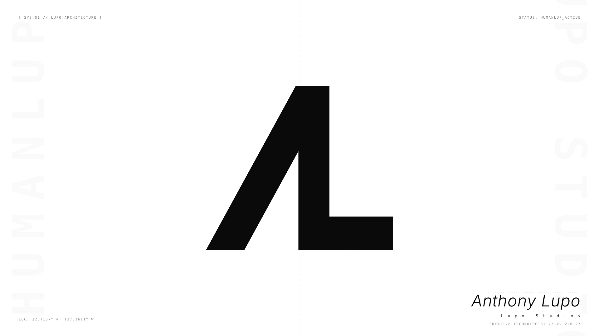

<p align="center">
  <a href="https://x.com/humanlup">@humanlup</a>&ensp;&middot;&ensp;<a href="https://instagram.com/_lupo">@_lupo</a>
</p>

&nbsp;

## Business operator and AI-native builder
- 10 years in tech sales
- self-taught builder since 2023
- I use AI tools daily to experiment, ship real work and create to feed a passion. 

&nbsp;

### Where my time goes

```text
Claude Code   ████████████████████████████░░░░░░░░░░░░░░  55%   workhorse
Frontend      ██████████░░░░░░░░░░░░░░░░░░░░░░░░░░░░░░░░  18%   Next.js, TypeScript
Gemini CLI    ████████░░░░░░░░░░░░░░░░░░░░░░░░░░░░░░░░░░  15%   second opinion
Design        ██████░░░░░░░░░░░░░░░░░░░░░░░░░░░░░░░░░░░░  12%   Figma, CSS
```

&nbsp;

#### Featured work

**Claude Code Skills Library** &ensp; `ai workflow`
<br>Custom skill system for Claude Code — reusable prompt-driven workflows for code review, design audits, performance checks, and content repurposing. Built through daily use, refined by real projects.

**Lupo Studios Brand System** &ensp; `design system`
<br>Full brand identity built through AI conversation — design tokens, OKLCH color system, typography scale, Tailwind v4 stylesheet, logo generation pipeline. One source of truth across every project.

**MCP Server Integrations** &ensp; `infrastructure`
<br>Connected Claude Code to Figma, GitHub, Google Calendar, and file systems through MCP. Practical integrations that let AI agents read real context instead of guessing.

**Client Web Projects** &ensp; `freelance`
<br>Web design and SEO work for small businesses — responsive sites, local search optimization, content strategy. Sales background means I understand what actually converts.

[Best Practice Guidelines](https://github.com/localwolfpackai/best-practice-guidelines)

&nbsp;

**There's a lot of us who approach things with poetry before logic. - Sean Brown**

---

<sub>**Lupo**</sub>
